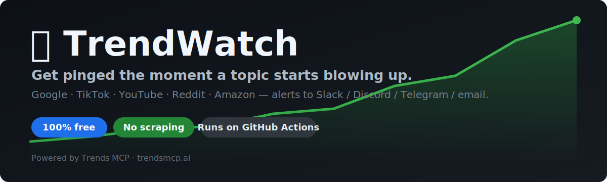
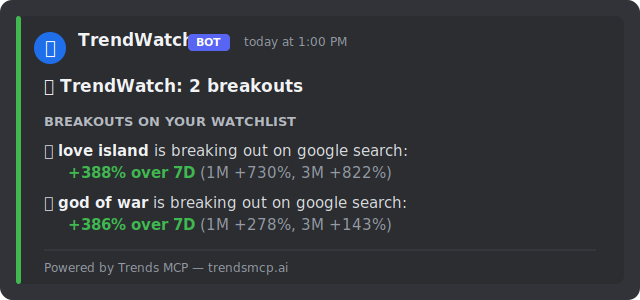

<div align="center">



# 📈 TrendWatch

### Get pinged the moment a topic starts blowing up — Google, TikTok, YouTube, Reddit, Amazon & more.

**Free. Runs in your own GitHub repo. No server, no scraping, no API keys to juggle.**

Fork it → add one free key → pick your keywords → GitHub Actions watches the trends and DMs you when something breaks out.

[](https://github.com/trendsmcp/trendwatch/generate)
[](https://trendsmcp.ai)

[](https://github.com/trendsmcp/trendwatch/stargazers)


</div>

---

<!--TRENDWATCH:START-->

### 📊 Live trends — updated 2026-06-07 16:51 UTC

**🔝 Google Trends right now**

`james handy` · `california election results` · `la mayor race` · `doodle for google` · `anthony head` · `bitcoin price` · `god of war laufey` · `love island voting` · `scott pelley` · `masters of the universe`

<sub>Auto-updated by TrendWatch · powered by [Trends MCP](https://www.trendsmcp.ai)</sub>

<!--TRENDWATCH:END-->

---

## Why TrendWatch?

You want to know **when** "your brand", a competitor, or a whole category starts trending — *before* everyone else does. The usual options are bad:

- 🧱 **Building a scraper** → breaks every time Google changes its HTML, needs a server, gets you rate-limited/blocked.
- 💸 **Enterprise trend tools** → $100s/month, overkill, locked behind sales calls.
- 👀 **Checking Google Trends by hand** → you forget, you miss the spike, you're late.

**TrendWatch** is the lazy, reliable middle path: a tiny open-source job that runs on GitHub's free Actions runners, calls the [Trends MCP](https://www.trendsmcp.ai) API for clean normalized data, and pings you in Slack / Discord / Telegram / email the instant something moves.

```
        your keywords            Trends MCP API              you, notified
   ┌────────────────────┐   ┌──────────────────────┐   ┌──────────────────┐
   │ "your brand"        │   │ Google · TikTok ·    │   │ 📈 Slack          │
   │ "competitor"        │──▶│ YouTube · Reddit ·   │──▶│ 💬 Discord        │
   │ "labubu"            │   │ Amazon · Wikipedia…  │   │ ✈️ Telegram       │
   └────────────────────┘   └──────────────────────┘   │ ✉️ Email / Webhook│
     config.yml               (1 clean API call)         └──────────────────┘
              ▲
        GitHub Actions runs this on a schedule — for free.
```

---

## ⚡ 60-second setup

1. **[Click "Use this template"](https://github.com/trendsmcp/trendwatch/generate)** → create your own copy of this repo.
2. **[Grab a free API key](https://trendsmcp.ai)** (100 requests/month, no credit card).
3. In *your* repo: **Settings → Secrets and variables → Actions → New repository secret**
   - Name: `TRENDS_API_KEY`  ·  Value: *(your key)*
4. **Edit [`config.yml`](config.yml)** — add the keywords you care about.
5. Go to the **Actions** tab, enable workflows, and hit **Run workflow** to test it.

That's it. It now runs on a schedule and alerts you. 🎉

> **Want desktop/phone alerts?** Add any of `SLACK_WEBHOOK_URL`, `DISCORD_WEBHOOK_URL`, `TELEGRAM_BOT_TOKEN` + `TELEGRAM_CHAT_ID`, or SMTP secrets. With none set, it still logs to the Actions console and updates your README dashboard.

---

## 🎯 What it detects

<div align="center">

</div>

**1. Watchlist breakouts** — your keywords, measured for momentum.
> 🚀 **labubu** is breaking out on google search: **+212%** over 7D  (1M +140%, 3M +320%)

**2. Newly trending** — anything fresh that hits the live leaderboards (with an optional interest filter).
> 🆕 **project hail mary** just entered Google Trends (#2)

Both land in the same alert, get written to [`reports/`](reports/) as dated Markdown, and refresh the live dashboard at the top of this README.

---

## 🔔 Notification channels

| Channel  | Secrets to add | How to get it |
|----------|----------------|---------------|
| **Slack** | `SLACK_WEBHOOK_URL` | [Slack incoming webhooks](https://api.slack.com/messaging/webhooks) |
| **Discord** | `DISCORD_WEBHOOK_URL` | Channel → Edit → Integrations → Webhooks |
| **Telegram** | `TELEGRAM_BOT_TOKEN`, `TELEGRAM_CHAT_ID` | [@BotFather](https://t.me/botfather) → new bot |
| **Email** | `SMTP_HOST`, `SMTP_PORT`, `SMTP_USER`, `SMTP_PASS`, `SMTP_TO` | Any SMTP (Gmail app password, Fastmail…) |
| **Anything else** | `GENERIC_WEBHOOK_URL` | Zapier / Make / n8n / your own endpoint |

Set one, several, or none — each activates only when its secret is present.

---

## 📡 Data sources you can watch

**Keyword momentum** (watchlist):
`google search` · `google images` · `google news` · `google shopping` · `youtube` · `tiktok` · `reddit` · `amazon` · `wikipedia` · `news volume` · `news sentiment` · `app downloads` · `npm` · `steam`

**Live leaderboards** (discovery):
`Google Trends` · `TikTok Trending Hashtags` · `YouTube Trending` · `Reddit Hot Posts` · `Amazon Best Sellers` · `App Store Top Free/Paid` · `Google News` · `Spotify Top Podcasts` · `Wikipedia Trending` · `X (Twitter) Trending` · `GitHub Trending Repos` · and more.

---

## 🧮 Staying inside the free tier

The free key gives you **100 requests/month**. TrendWatch spends **1 request per (keyword × source)** and **1 per leaderboard feed**, per run. Check your exact math anytime:

```bash
python -m trendwatch quota
```
```
Total per run           : 3 request(s)
Projected monthly usage by schedule:
  daily            ~  90 req/mo  [OK ]
  every 12 hours   ~ 180 req/mo  [OVER]
✓ On the free tier you can run up to: daily.
  Want more keywords or hourly checks? Upgrade: https://trendsmcp.ai/pricing
```

The default config (2 keywords + 1 feed, daily) lands at ~90/month — comfortably free. Need more? [Upgrade for more keywords, more sources, and hourly checks.](https://trendsmcp.ai/pricing)

---

## 🖥️ Run it locally (optional)

```bash
git clone https://github.com/YOUR_USERNAME/trendwatch.git
cd trendwatch
pip install -r requirements.txt
cp .env.example .env        # then paste your TRENDS_API_KEY into .env

python -m trendwatch check  # validate config + key
python -m trendwatch test   # send a test alert to your channels
python -m trendwatch run    # do a real check now
python -m trendwatch quota  # see your monthly usage
```

---

## ❓ FAQ

**Is this just a Google Trends scraper?**
No. There's no scraping anywhere in this repo — it makes authenticated API calls to [Trends MCP](https://www.trendsmcp.ai), which returns clean, normalized (0–100) trend data across 15+ platforms. No fragile HTML parsing, no Playwright, no proxies, no getting blocked.

**Do I have to pay?**
No. The free tier (100 req/month) covers daily monitoring of a small watchlist, which is what most people want. You only pay if you want more keywords, more sources, or higher frequency.

**Will my API key leak if my repo is public?**
No. Your key lives in GitHub **Secrets**, never in the code, and isn't exposed in logs or to forks of *your* repo. Everyone who uses TrendWatch brings their **own** key — there is no shared key in this template.

**Where does the data come from?**
From the Trends MCP API, which aggregates and normalizes signals from Google, YouTube, TikTok, Reddit, Amazon, Wikipedia, app stores, and more. See [trendsmcp.ai/docs](https://www.trendsmcp.ai/docs).

**Can my AI agent use the same data?**
Yes — Trends MCP is a [Model Context Protocol](https://modelcontextprotocol.io) server, so Claude, Cursor, and other MCP clients can query trends directly. TrendWatch is the "set-and-forget alerts" companion to that. See the [docs](https://www.trendsmcp.ai/docs).

---

## 📈 Star history

If TrendWatch is useful to you, a star helps others find it 🙏

<a href="https://star-history.com/#trendsmcp/trendwatch&Date">
  
</a>

---

## 🤝 Contributing

PRs welcome — new notification channels, smarter detection, nicer reports. See [CONTRIBUTING.md](CONTRIBUTING.md).

## ⭐ Like it?

**[Star this repo](https://github.com/trendsmcp/trendwatch)** so others can find it, and **[Use this template](https://github.com/trendsmcp/trendwatch/generate)** to spin up your own trend radar in a minute.

---

<div align="center">

Built with [Trends MCP](https://www.trendsmcp.ai) — live trend data for AI assistants, agents & automations.

<sub>TrendWatch is an open-source community project. It is not affiliated with, endorsed by, or sponsored by Google, TikTok, Reddit, Amazon, or any other platform named above. All trademarks belong to their respective owners.</sub>

</div>
